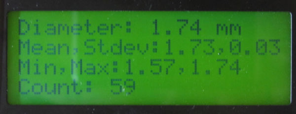

# Infidel data statistics demo sketch for Arduino.

These files are the basic Arduino sketch interfacing the Infidel, LCD-display and a simple library implementing running statistics. 
The original library usage of doubles, just four bytes large for the AVR CPUs, might not have have enough precision. 
A hacked version using fixed-point long ints is also used. Long ints are also four bytes, so it might not make much difference. But it was fun to make :-).

The LCD display just shows the actual value, mean value, standard deviation, minimum value, maximum value and the number of measurements. 
The values are from the fixed-point library. The Serial console displays more fractional digits and also values from the original RunningStat library.

* Source RunningStat library: https://www.johndcook.com/blog/standard_deviation/
* Infidel info: https://www.youmagine.com/designs/infidel-inline-filament-diameter-estimator-lowcost-10-24

ToDo:
* work out why the Arduino IDE doesn't want to work with the library header file. Including source code is not the correct way, but it appears to work.
* Allowing changing the measurement interval, now fixed to 5 seconds. There is a rudimentary command interpreter included, but it is not used now.

F.J. Kraan, fjkraan@electrickery.nl

